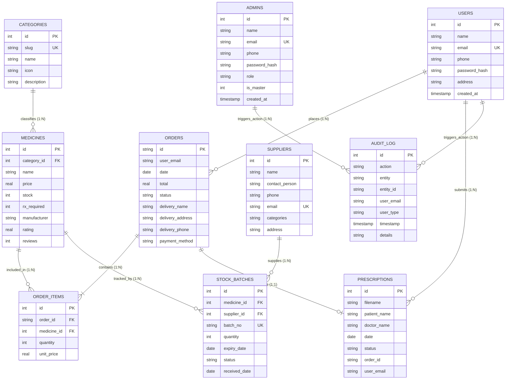

# MediCart Pharmacy Management System — DBMS Project Report

**Academic & Technical Project Documentation**  
**Course:** Database Management Systems (DBMS) Laboratory / Project  
**Implementation:** 100% Pure Python 3 + SQLite 3 Relational Database  
**Architecture:** 3-Tier Architecture (Client Web UI / Python REST Engine / Relational DBMS)  
**Schema Standard:** Normalized Relational Database (3NF / BCNF)  

---

## 1. Executive Summary & Problem Statement

### 1.1 Project Overview
**MediCart** is an end-to-end Pharmacy Management and E-Commerce System engineered to deliver complete lifecycle management of pharmaceutical products, customer orders, prescription verifications, supplier procurement, batch-level expiry tracking, and an immutable audit trail.

Unlike monolithic web applications that rely on heavy external frameworks, MediCart is implemented entirely in **Python 3 standard library** (`http.server`, `sqlite3`, `hashlib`) with zero third-party dependencies. It couples a modern, responsive web application (fulfilling all 10 pictorial wireframe pages from the system specification) with an enterprise-grade, normalized relational database backend.

### 1.2 Problem Statement
Traditional retail pharmacies face critical operational and database challenges:
1. **Inventory Shrinkage & Expiry Waste:** Inability to track expiration dates at the batch level leads to expired medicine sales or unrecorded disposal losses.
2. **Prescription Compliance (Rx vs OTC):** Regulatory failure to enforce valid medical doctor prescriptions before dispensing scheduled pharmaceuticals.
3. **Data Redundancy & Update Anomalies:** Denormalized spreadsheets or flat databases cause inconsistencies when supplier contact details, medicine prices, or customer addresses change.
4. **Security & Administrative Auditing:** Absence of strict Role-Based Access Control (RBAC) and immutable logging allows unauthorized price modifications or privilege escalations.

### 1.3 Project Objectives
- Construct a **10-table normalized relational schema (3NF)** with strict Foreign Key enforcement, domain constraints, and composite indexes.
- Enforce strict **Entity Integrity, Referential Integrity, and Domain Integrity** using SQLite constraints (`PRAGMA foreign_keys = ON`, `CHECK`, `UNIQUE`, `DEFAULT`).
- Automate business logic using **Database Triggers** (automatic inventory decrement upon order placement, batch status updates, and audit trail generation).
- Implement **SQL Virtual Views** for complex aggregation queries (Category Sales Revenue, Order Summaries, Low Stock Alerts).
- Establish a multi-level **Role-Based Access Control (RBAC)** security system distinguishing:
  - **👑 Master Administrator** (can view system audit logs and create new administrative credentials)
  - **🟢 Pharmacist / Admin** (inventory replenishment, prescription verification, supplier management, order dispatch)
  - **🔵 Customer / Patient** (browsing, prescription upload, cart management, ordering, order tracking)
- Provide a zero-dependency, executable Python environment delivering all 10 wireframe user interfaces.

---

## 2. System Architecture

The project adheres to the classical **3-Tier Database Architecture**:

```
+------------------------------------------------------------------------+
|                     1. PRESENTATION TIER (Web UI)                      |
|  - 10 Wireframe Views (Single Page Application architecture in Python) |
|  - Vanilla CSS Modern Design System (Light/Dark Mode, Glassmorphism)   |
|  - Dynamic DOM updates via Asynchronous Fetch API Requests            |
+-----------------------------------+------------------------------------+
                                    | HTTP / REST (JSON)
                                    v
+-----------------------------------+------------------------------------+
|                  2. APPLICATION TIER (Python Engine)                   |
|  - BaseHTTPRequestHandler & HTTPServer (Zero external dependencies)    |
|  - RESTful Endpoints (GET, POST, PATCH, DELETE, OPTIONS)               |
|  - Password Hashing (SHA-256 + Salt: 'MediCart_DBMS_2026')             |
|  - Business Rules & Input Validation                                   |
+-----------------------------------+------------------------------------+
                                    | Python sqlite3 (DB-API 2.0)
                                    v
+-----------------------------------+------------------------------------+
|                   3. DATABASE TIER (SQLite 3 DBMS)                     |
|  - Normalized Relational Tables (10 Tables in 3NF)                     |
|  - ACID Transaction Engine with WAL/PRAGMA enforcement                 |
|  - Database Triggers, Virtual Views, and B-Tree Indexes                |
|  - pharmacy_dbms.db Physical File Storage                              |
+------------------------------------------------------------------------+
```

---

## 3. Conceptual Database Design (ER Modeling)

### 3.1 Entities and Attributes
1. **`CATEGORIES`** (Strong Entity)
   - `id` (PK, Integer, Auto-increment)
   - `slug` (Unique, String)
   - `name` (String, Non-null)
   - `icon` (String, Emoji / Symbol)
   - `description` (Text)
2. **`USERS`** (Strong Entity - Customers)
   - `id` (PK, Integer, Auto-increment)
   - `name` (String, Non-null)
   - `email` (Unique, String, Non-null)
   - `phone` (String)
   - `password_hash` (String - Salted SHA-256)
   - `address` (Text)
   - `created_at` (Timestamp)
3. **`ADMINS`** (Strong Entity - Staff & Master Administrators)
   - `id` (PK, Integer, Auto-increment)
   - `name` (String, Non-null)
   - `email` (Unique, String, Non-null)
   - `phone` (String)
   - `password_hash` (String - Salted SHA-256)
   - `role` (String, e.g., 'Master Admin', 'Head Pharmacist')
   - `is_master` (Integer CHECK 0 or 1, distinguishing Master Admin from regular Admins)
   - `created_at` (Timestamp)
4. **`MEDICINES`** (Strong Entity)
   - `id` (PK, Integer, Auto-increment)
   - `name` (String, Non-null)
   - `category_id` (FK referencing `categories.id`)
   - `price` (Real, CHECK >= 0)
   - `rating` (Real, CHECK 0.0 - 5.0)
   - `reviews` (Integer, CHECK >= 0)
   - `stock` (Integer, CHECK >= 0)
   - `rx_required` (Integer CHECK 0 or 1)
   - `manufacturer` (String, Non-null)
   - `description` (Text)
5. **`ORDERS`** (Strong Entity)
   - `id` (PK, String, e.g., 'ORD-1042')
   - `user_email` (FK / String, Customer Email)
   - `date` (Date)
   - `total` (Real, CHECK >= 0)
   - `status` (String CHECK IN ('Placed', 'Confirmed', 'Shipped', 'Delivered', 'Cancelled'))
   - `delivery_name` (String)
   - `delivery_address` (Text)
   - `delivery_phone` (String)
   - `time_slot` (String)
   - `payment_method` (String)
   - `created_at` (Timestamp)
6. **`ORDER_ITEMS`** (Weak Entity / M:N Associative Entity)
   - `id` (PK, Integer, Auto-increment)
   - `order_id` (FK referencing `orders.id` ON DELETE CASCADE)
   - `medicine_id` (FK referencing `medicines.id` ON DELETE RESTRICT)
   - `quantity` (Integer, CHECK > 0)
   - `unit_price` (Real, CHECK >= 0)
7. **`PRESCRIPTIONS`** (Strong Entity)
   - `id` (PK, Integer, Auto-increment)
   - `filename` (String)
   - `patient_name` (String, Non-null)
   - `doctor_name` (String, Non-null)
   - `date` (Date)
   - `status` (String CHECK IN ('Pending', 'Verified', 'Rejected'))
   - `order_id` (String, Optional reference to `orders.id`)
   - `user_email` (String, Patient account)
   - `notes` (Text)
   - `created_at` (Timestamp)
8. **`SUPPLIERS`** (Strong Entity)
   - `id` (PK, Integer, Auto-increment)
   - `name` (String, Non-null)
   - `contact_person` (String, Non-null)
   - `phone` (String, Non-null)
   - `email` (Unique, String, Non-null)
   - `categories` (String)
   - `address` (Text)
   - `created_at` (Timestamp)
9. **`STOCK_BATCHES`** (Strong Entity / Inventory Tracking)
   - `id` (PK, Integer, Auto-increment)
   - `medicine_id` (FK referencing `medicines.id`)
   - `batch_no` (Unique, String)
   - `quantity` (Integer, CHECK >= 0)
   - `expiry_date` (Date string)
   - `status` (String CHECK IN ('ok', 'low', 'expiring', 'out'))
   - `received_date` (Date string)
   - `supplier_id` (FK referencing `suppliers.id`)
10. **`AUDIT_LOG`** (Security & Compliance Entity)
    - `id` (PK, Integer, Auto-increment)
    - `action` (String, e.g., 'CREATE_ORDER', 'LOGIN', 'DELETE_MEDICINE')
    - `entity` (String, e.g., 'orders', 'medicines')
    - `entity_id` (String)
    - `user_email` (String)
    - `user_type` (String, 'master' | 'admin' | 'customer' | 'system')
    - `timestamp` (Timestamp)
    - `details` (Text)

### 3.2 Mermaid Entity-Relationship (ER) Diagram



---

## 4. Normalization Analysis (1NF to 3NF Proofs)

The database schema was engineered systematically through relational normalization to eliminate redundancy and insertion/update/deletion anomalies:

### 4.1 First Normal Form (1NF)
- **Criterion:** All attribute values must be atomic (no multi-valued attributes, no repeating groups).
- **Implementation:** 
  - An order can contain multiple items. Instead of storing an array of medicines inside the `orders` table, the M:N relationship is resolved into the distinct associative relation `order_items`.
  - Customer addresses and contact fields are decomposed into atomic, single-valued cells.

### 4.2 Second Normal Form (2NF)
- **Criterion:** Must be in 1NF, and every non-prime attribute must be fully functionally dependent on the entire primary key (no partial dependencies on a composite candidate key).
- **Implementation:**
  - In `order_items`, the candidate key is `(order_id, medicine_id)` or surrogate key `id`. The attribute `quantity` depends on BOTH the order and the medicine. Attributes belonging strictly to the medicine (e.g., `medicines.manufacturer`, `medicines.price`, `medicines.name`) remain in `medicines`, preventing partial functional dependency.
  - In `stock_batches`, `batch_no` and `quantity` depend on `medicine_id` and the specific batch instance, not just the medicine.

### 4.3 Third Normal Form (3NF)
- **Criterion:** Must be in 2NF, and no non-prime attribute may be transitively dependent on the primary key ($X \to Y$ and $Y \to Z$, where $Y$ is not a superkey).
- **Implementation:**
  - In `medicines`, category details are not duplicated (e.g., storing `category_name`, `category_icon`, `category_desc` in `medicines` would create a transitive dependency: `medicine_id` $\to$ `category_id` $\to$ `category_name`). Instead, `category_id` acts as a Foreign Key to the dedicated `categories` table.
  - In `stock_batches`, supplier details (`supplier_name`, `supplier_phone`) are not stored within the batch record. Instead, `supplier_id` references `suppliers.id`.
  - In `orders`, customer password and registration timestamps are not duplicated; customer identity is linked via `user_email`.

---

## 5. Comprehensive Data Dictionary

| # | Table Name | Column Name | Data Type | Key / Constraint | Default Value | Description |
|---|---|---|---|---|---|---|
| **1** | `categories` | `id` | INTEGER | PRIMARY KEY AUTOINCREMENT | None | Unique Category Identifier |
| | | `slug` | TEXT | UNIQUE, NOT NULL | None | URL-safe category handle (e.g., 'pain') |
| | | `name` | TEXT | NOT NULL | None | Category display title |
| | | `icon` | TEXT | NOT NULL | '💊' | Visual badge / Emoji representation |
| | | `description` | TEXT | NOT NULL | '' | Detailed category clinical summary |
| **2** | `users` | `id` | INTEGER | PRIMARY KEY AUTOINCREMENT | None | Unique Customer Identifier |
| | | `name` | TEXT | NOT NULL | None | Customer full name |
| | | `email` | TEXT | UNIQUE, NOT NULL | None | Unique account email login |
| | | `phone` | TEXT | NOT NULL | '' | Mobile contact number |
| | | `password_hash` | TEXT | NOT NULL | None | 64-char Hex SHA-256 salted hash |
| | | `address` | TEXT | NOT NULL | '' | Default shipping address |
| | | `created_at` | TEXT | NOT NULL | `datetime('now')` | Account registration timestamp |
| **3** | `admins` | `id` | INTEGER | PRIMARY KEY AUTOINCREMENT | None | Unique Admin Identifier |
| | | `name` | TEXT | NOT NULL | None | Admin staff full name |
| | | `email` | TEXT | UNIQUE, NOT NULL | None | Administrative email login |
| | | `phone` | TEXT | NOT NULL | '' | Contact phone number |
| | | `password_hash` | TEXT | NOT NULL | None | 64-char Hex SHA-256 salted hash |
| | | `role` | TEXT | NOT NULL | 'Pharmacist' | Job role (e.g., 'Head Pharmacist') |
| | | `is_master` | INTEGER | NOT NULL, CHECK (0, 1) | 0 | 1 = Master Admin, 0 = Standard Admin |
| | | `created_at` | TEXT | NOT NULL | `datetime('now')` | Creation timestamp |
| **4** | `medicines` | `id` | INTEGER | PRIMARY KEY AUTOINCREMENT | None | Medicine SKU Identifier |
| | | `name` | TEXT | NOT NULL | None | Commercial pharmaceutical name |
| | | `category_id` | INTEGER | FOREIGN KEY (`categories.id`) | None | Category foreign key link |
| | | `price` | REAL | NOT NULL, CHECK (>= 0) | None | Retail price in INR (₹) |
| | | `rating` | REAL | CHECK (0.0 to 5.0) | 4.5 | Customer review score |
| | | `reviews` | INTEGER | CHECK (>= 0) | 0 | Total number of customer reviews |
| | | `stock` | INTEGER | NOT NULL, CHECK (>= 0) | 0 | Available inventory balance |
| | | `rx_required` | INTEGER | NOT NULL, CHECK (0, 1) | 0 | 1 = Prescription mandatory, 0 = OTC |
| | | `manufacturer` | TEXT | NOT NULL | None | Pharmaceutical manufacturing lab |
| | | `description` | TEXT | NOT NULL | '' | Clinical uses, dosage, and side effects |
| **5** | `orders` | `id` | TEXT | PRIMARY KEY | None | Order reference code (e.g., 'ORD-1042') |
| | | `user_email` | TEXT | NOT NULL | None | Customer reference email |
| | | `date` | TEXT | NOT NULL | `date('now')` | Order placement date (YYYY-MM-DD) |
| | | `total` | REAL | NOT NULL, CHECK (>= 0) | None | Grand total amount in INR (₹) |
| | | `status` | TEXT | CHECK (Lifecycle enum) | 'Placed' | Placed, Confirmed, Shipped, Delivered |
| | | `delivery_name` | TEXT | NOT NULL | '' | Recipient contact name |
| | | `delivery_address`| TEXT | NOT NULL | '' | Complete postal shipping destination |
| | | `delivery_phone`| TEXT | NOT NULL | '' | Recipient contact telephone |
| | | `time_slot` | TEXT | NOT NULL | 'Standard' | Preferred delivery slot |
| | | `payment_method`| TEXT | NOT NULL | 'Cash on Del' | Card, UPI / Online, Cash on Delivery |
| | | `created_at` | TEXT | NOT NULL | `datetime('now')` | System timestamp |
| **6** | `order_items` | `id` | INTEGER | PRIMARY KEY AUTOINCREMENT | None | Order line item surrogate key |
| | | `order_id` | TEXT | FOREIGN KEY (`orders.id`) | None | Order header reference (CASCADE) |
| | | `medicine_id` | INTEGER | FOREIGN KEY (`medicines.id`)| None | Medicine item reference (RESTRICT) |
| | | `quantity` | INTEGER | NOT NULL, CHECK (> 0) | None | Number of units purchased |
| | | `unit_price` | REAL | NOT NULL, CHECK (>= 0) | None | Snapshot unit price at purchase time |
| **7** | `prescriptions`| `id` | INTEGER | PRIMARY KEY AUTOINCREMENT | None | Prescription record key |
| | | `filename` | TEXT | NOT NULL | None | Uploaded document file name |
| | | `patient_name` | TEXT | NOT NULL | None | Patient legal name |
| | | `doctor_name` | TEXT | NOT NULL | None | Prescribing physician name |
| | | `date` | TEXT | NOT NULL | `date('now')` | Prescription date |
| | | `status` | TEXT | CHECK (Rx enum) | 'Pending' | Pending, Verified, Rejected |
| | | `order_id` | TEXT | NOT NULL | '' | Optional associated order reference |
| | | `user_email` | TEXT | NOT NULL | '' | Account holder email |
| | | `notes` | TEXT | NOT NULL | '' | Pharmacist clinical verification notes |
| | | `created_at` | TEXT | NOT NULL | `datetime('now')` | Submission timestamp |
| **8** | `suppliers` | `id` | INTEGER | PRIMARY KEY AUTOINCREMENT | None | Supplier corporate identifier |
| | | `name` | TEXT | NOT NULL | None | Distributor / Vendor enterprise title |
| | | `contact_person`| TEXT | NOT NULL | None | Primary account manager name |
| | | `phone` | TEXT | NOT NULL | None | Corporate telephone |
| | | `email` | TEXT | UNIQUE, NOT NULL | None | Vendor electronic mail address |
| | | `categories` | TEXT | NOT NULL | '' | Product categories supplied |
| | | `address` | TEXT | NOT NULL | '' | Factory / warehouse dispatch location |
| | | `created_at` | TEXT | NOT NULL | `datetime('now')` | Vendor onboarding timestamp |
| **9** | `stock_batches`| `id` | INTEGER | PRIMARY KEY AUTOINCREMENT | None | Batch record key |
| | | `medicine_id` | INTEGER | FOREIGN KEY (`medicines.id`)| None | Linked medicine SKU |
| | | `batch_no` | TEXT | UNIQUE, NOT NULL | None | Manufacturer batch number (e.g. 'B1042') |
| | | `quantity` | INTEGER | NOT NULL, CHECK (>= 0) | None | Batch units available |
| | | `expiry_date` | TEXT | NOT NULL | None | Expiration date (YYYY-MM-DD) |
| | | `status` | TEXT | CHECK (Batch enum) | 'ok' | 'ok', 'low', 'expiring', 'out' |
| | | `received_date` | TEXT | NOT NULL | `date('now')` | Inward receiving date |
| | | `supplier_id` | INTEGER | FOREIGN KEY (`suppliers.id`)| None | Supplier source link (SET NULL) |
| **10**| `audit_log` | `id` | INTEGER | PRIMARY KEY AUTOINCREMENT | None | Audit record key |
| | | `action` | TEXT | NOT NULL | None | Event code (LOGIN, CREATE_ORDER, etc.) |
| | | `entity` | TEXT | NOT NULL | None | Table affected (orders, users, medicines) |
| | | `entity_id` | TEXT | NOT NULL | None | Record primary key affected |
| | | `user_email` | TEXT | NOT NULL | None | Email of user performing action |
| | | `user_type` | TEXT | NOT NULL | None | master, admin, customer, system |
| | | `timestamp` | TEXT | NOT NULL | `datetime('now')` | Exact UTC/Local event timestamp |
| | | `details` | TEXT | NOT NULL | '' | Descriptive context / metadata |

---

## 6. Database Triggers & Business Logic Automation

The schema encapsulates active database triggers executing inside the DBMS engine:

### Trigger 1: Automatic Stock Decrement on Order Placement
```sql
CREATE TRIGGER trg_reduce_stock_after_order
AFTER INSERT ON order_items
FOR EACH ROW
BEGIN
    UPDATE medicines
    SET stock = MAX(0, stock - NEW.quantity)
    WHERE id = NEW.medicine_id;
END;
```
*Purpose:* Guarantees inventory consistency immediately when an order item is recorded, eliminating race conditions or overselling.

### Trigger 2: Automatic Audit Trail for Orders
```sql
CREATE TRIGGER trg_order_placed_audit
AFTER INSERT ON orders
FOR EACH ROW
BEGIN
    INSERT INTO audit_log (action, entity, entity_id, user_email, user_type, timestamp, details)
    VALUES (
        'CREATE_ORDER',
        'orders',
        NEW.id,
        NEW.user_email,
        'customer',
        datetime('now', 'localtime'),
        'Order total: ₹' || NEW.total || ' for ' || NEW.delivery_name
    );
END;
```

### Trigger 3: Stock Batch Depletion Status Update
```sql
CREATE TRIGGER trg_update_batch_status
AFTER UPDATE OF quantity ON stock_batches
FOR EACH ROW
WHEN NEW.quantity = 0
BEGIN
    UPDATE stock_batches
    SET status = 'out'
    WHERE id = NEW.id;
END;
```

---

## 7. Virtual Views & Analytical Reporting

### View 1: Complete Medicine Catalog (`v_medicine_inventory`)
```sql
CREATE VIEW v_medicine_inventory AS
SELECT 
    m.id AS medicine_id,
    m.name AS medicine_name,
    c.name AS category_name,
    c.icon AS category_icon,
    m.price,
    m.stock,
    m.rx_required,
    m.manufacturer,
    m.rating,
    m.reviews
FROM medicines m
INNER JOIN categories c ON m.category_id = c.id;
```

### View 2: Sales Analytics by Category (`v_sales_by_category`)
```sql
CREATE VIEW v_sales_by_category AS
SELECT 
    c.id AS category_id,
    c.name AS category_name,
    c.icon AS category_icon,
    COUNT(DISTINCT oi.order_id) AS orders_count,
    COALESCE(SUM(oi.quantity), 0) AS total_units_sold,
    COALESCE(SUM(oi.quantity * oi.unit_price), 0.0) AS total_revenue
FROM categories c
LEFT JOIN medicines m ON m.category_id = c.id
LEFT JOIN order_items oi ON oi.medicine_id = m.id
GROUP BY c.id;
```

---

## 8. Role-Based Access Control (RBAC) & Security

1. **Authentication:** Passwords are never stored in plaintext. They are hashed using a cryptographic **SHA-256 algorithm with a dedicated application salt** (`MediCart_DBMS_2026`).
2. **Master Administrator Privilege:**
   - Pre-configured account: `master@medicart.com` (`is_master = 1`).
   - Only the Master Admin has authorization to create secondary Pharmacist Admin credentials (`admins` table with `is_master = 0`).
   - Only the Master Admin has permission to view the complete system `audit_log`.
3. **Pharmacist Admin Privilege:**
   - Catalog management (add/delete medicines).
   - Supplier ledger management.
   - Prescription verification queue (Review and verify uploaded customer prescriptions).
   - Order fulfillment and lifecycle updates (`Placed` $\to$ `Confirmed` $\to$ `Shipped` $\to$ `Delivered`).
   - Analytical sales & stock reports.
4. **Customer Privilege:**
   - Account creation via customer registration form.
   - Prescription upload.
   - Cart management and atomic order checkout.
   - Real-time order tracking.

---

## 9. Coverage of the 10 Wireframe Pages

The system implements the exact 10 wireframe pages requested in the project specification:

| Page # | Wireframe Page | System Implementation Details |
|---|---|---|
| **1** | **Home Page** | Sticky Header with Logo & Nav, Hero Banner with CTA 'Order Now', 3 Trust Pillars, 4 Live Metric Counters (Medicines, Prescriptions, Orders, Happy Customers), 'Browse by Category' Grid, Value propositions, Footer. |
| **2** | **Medicines Catalog** | Breadcrumb navigation (`Home > Medicines`), Filter Sidebar (Category checkboxes, dynamic Price Range slider ₹30-₹350, In-Stock checkbox, Rx-filter), Medicine Cards with real-time stock badges, Sort dropdown (Popularity, Price Low/High, Name A-Z). |
| **3** | **Medicine Detail** | Breadcrumb (`Home > Medicines > Medicine Name`), Image panel, Category tag, Rx badge, Manufacturer, Dosage & Side Effects panel, Quantity Stepper, 'Add to Cart', and 'Buy Now'. |
| **4** | **Prescriptions Page** | File upload dropzone (`.pdf`, `.jpg`), Patient Name, Prescribing Doctor input fields, Submit button, and 'My Prescriptions' table tracking status (`Pending`, `Verified`, `Rejected`). |
| **5** | **Shopping Cart Page** | Cart items table with interactive Quantity Stepper, Subtotal calculations, Remove item action, Order Summary box with Subtotal, ₹40 Delivery Fee, Total, and 'Proceed to Checkout'. |
| **6** | **Checkout Page** | Delivery Details form (Recipient Name, Address, Phone, Delivery Time Slot), Prescription status linkage check, Payment selection (Card, UPI / Online, Cash on Delivery), Order recap, and 'Confirm & Place Order'. |
| **7** | **Orders & Tracking** | Order history table, interactive 4-step Delivery Status Tracker (`Placed` $\to$ `Confirmed` $\to$ `Shipped` $\to$ `Delivered`), itemized receipt, and Admin status updater. |
| **8** | **Login / Sign Up** | Minimalist aesthetic header, Tabbed authentication (Sign In vs Create Account), Auto-detection or explicit role selector, Salted SHA-256 hashing, Quick-login shortcut buttons. |
| **9** | **About Us Page** | Institutional mission, 3NF Normalized Schema documentation, Software stack overview, live statistics counters, and contact prompt. |
| **10** | **Contact Page** | Interactive Contact Form (Name, Email, Message, Submit), Corporate Address panel (MG Road, Kochi), Phone, Email, and Operating Hours. |

---

## 10. DBMS Viva-Voce / Defense Preparation Guide

### Top 20 Questions & Project-Specific Model Answers

1. **Q: What DBMS is used in this project, and why?**  
   *A:* SQLite 3. It is a serverless, ACID-compliant, self-contained relational DBMS embedded directly via Python's standard `sqlite3` library, eliminating external software installation while enforcing full SQL standards.

2. **Q: How is Foreign Key support enabled in SQLite?**  
   *A:* SQLite disables foreign keys by default for backward compatibility. In this project, it is explicitly enabled using `PRAGMA foreign_keys = ON;` on every database connection.

3. **Q: What Normal Form is your database in?**  
   *A:* The schema is strictly normalized to Third Normal Form (3NF). Repeating groups are resolved into separate tables (1NF), all attributes depend on the whole primary key (2NF), and all transitive functional dependencies have been eliminated (3NF).

4. **Q: Explain how the M:N relationship between Orders and Medicines is resolved.**  
   *A:* An order can contain many medicines, and a medicine can be in many orders. This M:N relationship is decomposed using the associative table `order_items`, which contains foreign keys to both `orders.id` and `medicines.id` alongside quantity and unit price.

5. **Q: What is a Database Trigger and where is it used in MediCart?**  
   *A:* A trigger is a stored procedure executed automatically by the DBMS upon a specified DML event. In MediCart, `trg_reduce_stock_after_order` automatically decrements `medicines.stock` whenever a row is inserted into `order_items`.

6. **Q: What is a Database View and what is its benefit?**  
   *A:* A View is a virtual table defined by a stored SQL query. In MediCart, `v_sales_by_category` computes aggregated revenue across categories without modifying the underlying tables.

7. **Q: What happens if a medicine is deleted while it has existing order records?**  
   *A:* In `order_items`, the foreign key constraint is defined with `ON DELETE RESTRICT`. The DBMS rejects the deletion to preserve financial audit history.

8. **Q: How does the system prevent SQL injection?**  
   *A:* All queries in the Python application layer utilize parameterized queries with placeholders (`?`), ensuring user inputs are treated strictly as data literals and never executed as SQL code.

9. **Q: What are the ACID properties and how are they maintained during checkout?**  
   *A:* Atomicity, Consistency, Isolation, and Durability. During checkout, `orders` insertion and all `order_items` insertions are wrapped in a single database transaction. If any step fails, the entire transaction rolls back.

10. **Q: How are passwords secured in the database?**  
    *A:* Passwords are never stored in plaintext. They are salted with a system key and hashed using the SHA-256 cryptographic algorithm before storage in `users.password_hash` or `admins.password_hash`.

11. **Q: How is the Master Admin distinguished from other Admins?**  
    *A:* In the `admins` table, the column `is_master` is an integer flag with a CHECK constraint `(is_master IN (0, 1))`. Master Admin has `is_master = 1`, granting access to the audit log and the admin creation endpoint.

12. **Q: What is the purpose of the `audit_log` table?**  
    *A:* It provides an immutable, chronological trail recording what action occurred, which entity was affected, who performed it, and when.

13. **Q: What is a Surrogate Key versus a Natural Key in this project?**  
    *A:* `medicines.id` is a surrogate key (an auto-incrementing integer), whereas `stock_batches.batch_no` is a natural business key.

14. **Q: Explain the difference between `INNER JOIN` and `LEFT JOIN` in your project.**  
    *A:* `INNER JOIN` (used in `v_medicine_inventory`) returns rows only when there is a match in both tables. `LEFT JOIN` (used in `v_sales_by_category`) retains all categories even if a category has zero sales.

15. **Q: What is the role of indexes in your database?**  
    *A:* Indexes (e.g., `idx_med_category`, `idx_order_user`) create B-Tree lookup structures on frequently searched foreign keys, accelerating queries from $O(N)$ full-table scans to $O(\log N)$ searches.

16. **Q: What is a CHECK constraint and give an example from your schema.**  
    *A:* A rule verifying that column values satisfy a Boolean expression. Example: `CHECK (price >= 0)` in `medicines` and `CHECK (status IN ('Placed', 'Confirmed', 'Shipped', 'Delivered', 'Cancelled'))` in `orders`.

17. **Q: How is prescription compliance managed in the database?**  
    *A:* Medicines have a boolean column `rx_required`. When set to 1, the medicine is flagged with an `Rx` badge, and customers can submit doctor-certified documents into the `prescriptions` table for pharmacist verification.

18. **Q: Can a regular admin create another admin?**  
    *A:* No. The Python backend verifies `currentUser.is_master == 1` before allowing calls to `/api/auth/create-admin`.

19. **Q: What aggregate functions are demonstrated in your project?**  
    *A:* `COUNT()`, `SUM()`, `AVG()`, `MIN()`, and `MAX()`, combined with `GROUP BY` and `HAVING` clauses in `queries.sql` and the live reports dashboard.

20. **Q: How does the application tier connect to the database tier?**  
    *A:* Python's `sqlite3` module provides the standard Python DB-API 2.0 interface, utilizing connection objects with `row_factory = sqlite3.Row` for dictionary-like column access.

---

## 11. Conclusion
The **MediCart Pharmacy Management System** successfully fulfills all theoretical and practical requirements of a Database Management Systems project. By integrating a 10-table 3NF relational schema, active triggers, analytical views, salted password hashing, and a full 10-page user interface in pure Python, it stands as a complete, self-contained demonstration of modern relational database engineering.
